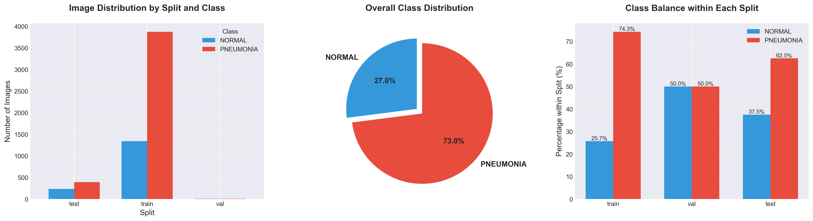
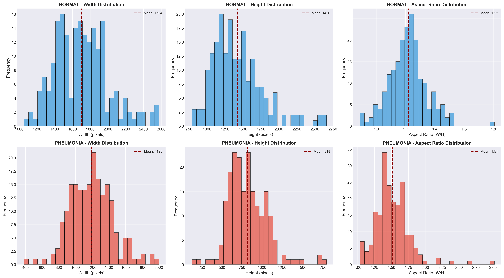

# Pneumonia Detection from Chest X-Rays using Deep Learning 🫁

[](https://www.python.org/)
[](https://pytorch.org/)
[](LICENSE)
[](https://www.kaggle.com/paultimothymooney/chest-xray-pneumonia)

## 📊 Project Overview

> Developing advanced deep learning models for automated pneumonia detection in chest X-rays, implementing novel attention mechanisms for improved accuracy and interpretability.

<div align="center">
  
  <p><i>Sample chest X-rays showing normal (top) and pneumonia (bottom) cases</i></p>
</div>
This project implements a deep learning solution for automated detection of pneumonia from chest X-ray images. Using a combination of Convolutional Neural Networks (CNNs) and attention mechanisms, the system can classify chest X-rays as either normal or showing signs of pneumonia.

### Dataset
- **Source**: [Chest X-Ray Images (Pneumonia) on Kaggle](https://www.kaggle.com/paultimothymooney/chest-xray-pneumonia)
- **Size**: ~2.3 GB
- **Classes**: Normal vs Pneumonia
- **Total Images**: 5,856 chest X-ray images
- **Split Distribution**: 70/15/15 (Train/Validation/Test)

## Project Structure
```
pneumonia-detection-cnn/
├── data/                      # Dataset directory (not in repo)
│   └── chest_xray/           # Raw chest X-ray images
├── notebooks/                 # Jupyter notebooks
│   ├── 01_setup_and_exploration.ipynb    # Data exploration and setup
│   ├── data_preprocessing.ipynb          # Data pipeline and augmentation
│   ├── 04_attention_model.ipynb         # Attention mechanism implementation
│   └── 05_final_model.ipynb            # Final model training and evaluation
├── results/                  # Results and visualizations
│   └── figures/             # Generated plots and visualizations
└── config.json              # Project configuration
```

## Key Features
1. **Comprehensive Data Analysis**
   - Detailed exploration of dataset characteristics
   - Analysis of class distribution and imbalance
   - Image dimension and intensity distribution analysis

2. **Robust Data Pipeline**
   - Efficient data loading and preprocessing
   - Image resizing to 224×224 pixels
   - Data augmentation techniques for better generalization

3. **Advanced Model Architecture**
   - CNN-based architecture with attention mechanisms
   - Focal Loss to handle class imbalance (3:1 ratio)
   - Learning rate scheduling for optimal training

## Results
- Class Distribution Analysis:
  

- Image Dimension Analysis:
  

## Technical Details
- **Framework**: PyTorch
- **Image Size**: 224×224 pixels
- **Data Augmentation**:
  - Horizontal flips
  - Random rotations (±15°)
  - Brightness/contrast adjustments
  - Random noise injection

- **Model Features**:
  - Attention mechanisms for focused feature extraction
  - Focal Loss for handling class imbalance
  - Learning rate scheduling with ReduceLROnPlateau
  - Batch size: 32

## Setup and Usage

1. **Environment Setup**
   ```bash
   # Clone the repository
   git clone https://github.com/omkarb40/pneumonia-detection-cnn.git
   cd pneumonia-detection-cnn

   # Create and activate virtual environment
   python -m venv venv
   source venv/bin/activate  # On Windows: venv\Scripts\activate

   # Install dependencies
   pip install -r requirements.txt
   ```

2. **Dataset Download**
   - Download the dataset from [Kaggle](https://www.kaggle.com/paultimothymooney/chest-xray-pneumonia)
   - Place the downloaded data in the `data/` directory
   - Run the data preprocessing notebook to create proper train/val/test splits

3. **Training and Evaluation**
   - Follow the notebooks in sequential order:
     1. Data exploration and setup
     2. Data preprocessing and augmentation
     3. Model training with attention mechanisms
     4. Final evaluation and results

## Course Information
- **Course**: CIS 602 - Fundamentals of Deep Learning
- **Author**: Omkar Badadale
- **Date**: November 2025

## Acknowledgments
- Dataset provided by Paul Mooney on Kaggle
- Chest X-ray images were selected from retrospective cohorts of pediatric patients of one to five years old from Guangzhou Women and Children's Medical Center